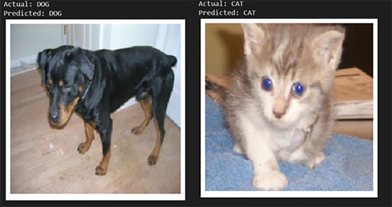

# Cat vs Dog Classifier using CNN in Pytorch

This projects contains a CNN Classifier for classifying images. PyTorch Deep Learning Library is used for it.

Dataset can be downloaded from [LINK](https://drive.google.com/drive/folders/1-5pxr56iH5e1dDOfhJ4AqABDkcbVpE-v?usp=sharing).
Download the folder and place it as `../Cat_Dog_Classifier_CNN/cats_and_dogs_small'`

Directory Looks Like
```
Cat_Dog_Classifier_CNN/
|   README.md
|   CatsDogsClassifier.ipynb
|
|___cats_and_dogs_small/
|   |___train/
|   |   |___cats/
|   |   |   |   cat.*.jpg
|   |   |   |   ...
|   |   |      
|   |   |___dogs/
|   |   |   |   dog.*.jpg
|   |   |   |   ...
|   |   
|   |___validation/
|   |   |___cats/
|   |   |   |   cat.*.jpg
|   |   |   |   ...
|   |   |      
|   |   |___dogs/
|   |   |   |   dog.*.jpg
|   |   |   |   ...
|   |
|   |___test/
|   |   |___cats/
|   |   |   |   cat.*.jpg
|   |   |   |   ...
|   |   |      
|   |   |___dogs/
|   |   |   |   dog.*.jpg
|   |   |   |   ...

```
<hr>

## Contents
1.  Loading Images from the directory and classes as per Directory Structure
2.  Making Visualization Functions for Quick and beautiful Visualization of data
3.  Updating Pre-Trained VGG19 Architecture to suit our application
4.  Training the model and collecting metrics (Accuracy and Loss)
5.  Evaluating the model
6.  Visualizing the filters
7.  Visualization of Feature Maps

<hr>



Feel free to PR.
