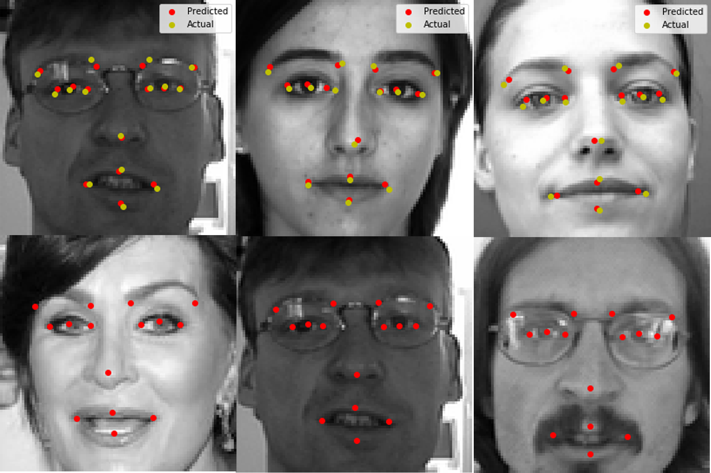

# Facial Keypoints Detection using Deep Learning

This project detects 15 landmarks/keypoints on face using Deep Learning implemented in PyTorch.

The dataset can be downloaded from Kaggle Website: (Link)[https://www.kaggle.com/c/facial-keypoints-detection/data]

1.  From the website, download `IdLookupTable.csv` , `training.zip` and `test.zip`.
2.  Extract `training.csv` and `test.csv` from `training.zip` and `test.zip` respectively.
3.  Place `IdLookupTable.csv`, `training.csv` and `test.csv` in the root directory.
After this, the directory looks like:

```
Facial_Keypoints_Detection
|       Facial_Keypoints_detection.ipynb
|       README.md
|       test.csv
|       training.csv
|       weights.pth
|       IdLookupTable.csv
|
```

The pre-trained weights are present int he root directory:  `weights.pth`
<hr>

## Contents
1.  Making Custom PyTorch Dataset Class to load CSV file and extract keypoints locations and Image from pixel values.
2.  Visualizing the dataset (Face Image and Facial Keypoints).
3.  Making the CNN Architecture from scratch in PyTorch.
4.  Training the Model
5.  Visualizing the Loss Function
6.  Inferencing the model by seeing predicted keypoints over face images.
7.  Finally, creating the submission file for Kaggle Competition.
<hr>




Feel free to PR.
